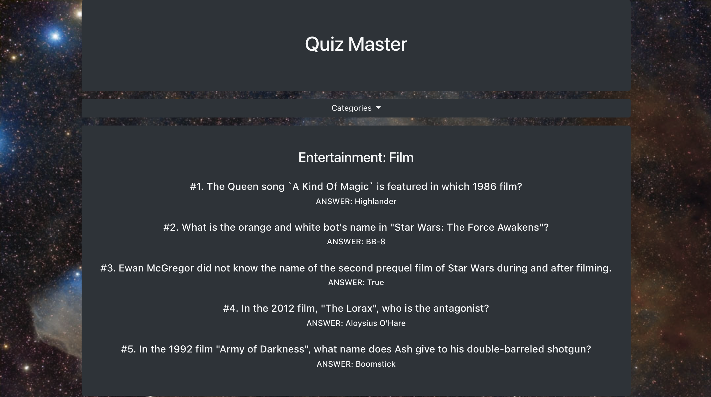

# Quiz Master

### Overview

In this assignment, you'll use the opentdb API to make a dynamic web page that populates with trivia questions and their correct answers based on a category of your choice. To finish this task, you must call the opentdb API and use JavaScript and jQuery to change the HTML of your site. You will also call the NASA API to decorate your website by pulling NASA's picture of the day and making it the background of your website.

### Before You Begin

1. **Understand how opentdb works**.
   * Visit the Open Trivia Database API site. [opentdb](https://opentdb.com/api_config.php).
   * While opentdb does not require a key, you still need to understand how to call it. Try messing with the different fields on the site and generate different URLs. We recommend the following:
    * Set the difficulty to easy.
    * Only call five questions at a time so it's easier to manage the response.
    * Checkout how the "Category" field works and think about how you can use javascript variables to change the category.
        * __NOTE:__ You can view the available categories and their unique IDs in a JSON provided by opentdb. [Categories](https://opentdb.com/api_category.php).
    * Use the default encoding.
    * __NOTE:__ There are two types of questions, booleans and multiple choice. Though differentiating between the two is a BONUS for this assignment, it's useful to check out different responses and understand how the resulting JSON is constructed.

2. **Hit the NASA API**.
   * Check out the NASA API. [NASA API](https://api.nasa.gov).
   * Like many APIs NASA requires a key before you can make a call. Readh through the documentation and sign up for a personal key.
   * Read through the documentation and learn to call the picture of the day (HINT: APOD)
   * __NOTE:__ The image can sometimes be a YouTube video. Check the response URL in the console before assuming your code is broken! If this happens to you, don't worry, the image changes every day. It should work tomorrow ;)

2. **[Watch the demo video](PENDING)**

   * You should have a high-level understanding of how this assignment works before attempting to code it.

### Submission on BCS

* Please submit both the deployed Github.io link to your homework AND the link to the Github Repository!

### Instructions

1. Before you can create any quizes, you need to list the categories in a dropdown menu.
   * In addition to listing the category in html, you will need to keep track of their unique IDs. Make a function that cycles through the JSON and dynamically stores the necessay information in HTML. (HINT: data-sets).

2. Your app should listen for clicks in the dropdown menu and dynamically generate a short quiz based on the selected category.
   * Try using the unique ID that you stored in the HTML for each category in the previous step.
   * You will need to include the unique ID as part of the URL in the AJAX request.

3. The previous Quiz should clear every time you select a new category to generate a new one. JQuery is your friend, use it wisely.

4. Make a function that calls NASA's image of the day and place it as the background of the site. 
    * This should happen automatically on load. (HINT: You don't need an additional style.css file for this, you can set the background from your .js file).

5. Deploy your assignment to Github Pages.

6. **Have a party**! And quiz your friends on random trivia.

- - -

### Minimum Requirements

Attempt to complete homework assignment as described in instructions. If unable to complete certain portions, please pseudocode these portions to describe what remains to be completed. Adding a README.md as well as adding this homework to your portfolio are required as well and more information can be found below.

- - -

### Bonus Goals

1. Ensure your app is fully mobile responsive.

2. Sort the categories in alphabetical order (HINT: We haven't covered this yet, but some good old google-foo can get you there. Do you understand what is happening? Could you explain it to your peers?)

3. Differentiate between boolean and multiple choice type questions. This will be tough because multiple choice questions don't have a property with all possible answers. Instead, there is a property with the correct answer, and another one with the incorrect answers. How can you dynamically mix them up and display them in a random order? Can you highlight the correct answer each time?

4. Make the quiz interactive. The basic assignment is meant for a single person to hold the questions and the answers. Can you make it so that the user needs to guess the answers and receives a result on their trivia knowledge at the end?

### Reminder: Submission on BCS

* Please submit both the deployed Github.io link to your homework AND the link to the Github Repository!

- - -

### Create a README.md

Add a `README.md` to your repository describing the project. Here are some resources for creating your `README.md`. Here are some resources to help you along the way:

* [About READMEs](https://help.github.com/articles/about-readmes/)

* [Mastering Markdown](https://guides.github.com/features/mastering-markdown/)

- - -

### Add To Your Portfolio

After completing the homework please add the piece to your portfolio. Make sure to add a link to your updated portfolio in the comments section of your homework so the TAs can easily ensure you completed this step when they are grading the assignment. To receive an 'A' on any assignment, you must link to it from your portfolio.

- - -

### One More Thing

If you have any questions about this project or the material we have covered, please post them in the community channels in slack so that your fellow developers can help you! If you're still having trouble, you can come to office hours for assistance from your instructor and TAs.

**Good Luck!**
